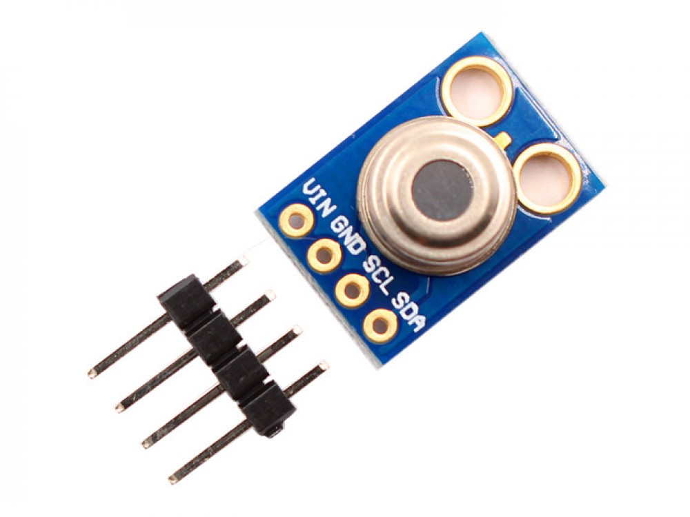

# MLX90614 Infra-Red Temperature Sensor

Starter code for using an MLX90614 infra-red temperature sensor.

The MLX90614 is an infrared thermometer for non-contact temperature measurements made by Melexis. It is available as just the sensor, or on a breakout board. This guide will be for the breakout board configured for I2C communication. For wiring the sensor without a breakout board or for PWM communication, see https://learn.sparkfun.com/tutorials/mlx90614-ir-thermometer-hookup-guide/all

The default address for the sensor is 0x5a.

 

## Boards

Setup instructions and starter code for different development boards

| Board | Folder |
| --- | --- |
| Arduino Uno | [arduino-uno/](arduino-uno/) |
| Arduino MKR WiFi 1010 | For MKR WiFi 1010 follow instructions for Arduino Uno [arduino-uno/](arduino-uno/) |
| Arduino Nano 33 BLE | For Nano 33 BLE follow instructions for Arduino Uno [arduino-uno/](arduino-uno/) |
| ESP32 | For ESP32 boards, follow instructions for ESP8266 [esp8266/](esp8266/) |
| ESP8266 | [esp8266/](esp8266/) |
| Jetson Nano | For Jetson Nano, follow instructions for Raspberry Pi [raspberry-pi/](raspberry-pi/) |
| Raspberry Pi | [raspberry-pi/](raspberry-pi/) |
|  |  |

 

## Other Files and Folders

| File/Folder | Description |
|--- | --- |
| [additional-libraries/](additional-libraries/) | Folder contains libraries needed for Arduino sketches. They are included as submodules. Use either `git clone --recursive` or `git submodule init` after cloning. |
| [docs/MLX90614-Datasheet-Melexis.pdf](docs/MLX90614-Datasheet-Melexis.pdf) | Data sheet for sensor |
|  |  |

 

## Branches

**main**: main branch. currently not using other branches.

 

## References

- https://www.melexis.com/en/product/MLX90614/Digital-Plug-Play-Infrared-Thermometer-TO-Can
