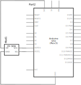
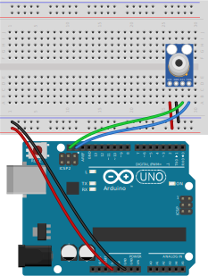

# Arduino Uno and MLX90614 Infra-Red Temperature Sensor

Setup instructions and starter code for using the MLX90614 infra-red temperature sensor and an Arduino development board.

 

## Files and Folders

| File/Folder | Description |
|--- | --- |
| [arduino/](arduino/) | Arduino projects folder |
| [arduino/mlx90614-temperature-sensor/mlx90614-temperature-sensor.ino](arduino/mlx90614-temperature-sensor/mlx90614-temperature-sensor.ino) | Simple arduino sketch. |
| [mkr-wifi-1010-setup.md](mkr-wifi-1010-setup.md) | Setup instructions for using an Arduino MKR WiFi 1010 dev board. |
|  |  |

 

## Setup

Setup instructions for an Arduino Uno board is below. For MKR WiFi 1010 based setup instructions see [mkr-wifi-1010-setup.md](mkr-wifi-1010-setup.md).

## Circuit Diagram
Wire the components as shown in the diagram. Note, the sensor is available in 3V or 5V versions. Be sure to use the correct voltage for the sensor.

#### Components Needed
* mlx90614 sensor breakout board
* connecting wires
* arduino uno development board

 

 

### Default Pin Wiring

| Pin No | Function |  | Device Connection |
| --- | --- | --- | --- |
| VCC | +3.3V |  | Vin |
| GND | GND |  | GND |
| 18 | SDA |  | SDA |
| 19 | SCL |  | SCL |
|  |  |  |  |

 

## Arduino

The sketch will work with many different types and chipset of board. To use an Arduino Uno, make sure to select the correct board in Boards Manager.

The arduino sketches require the Adafruit MLX90614 library. It is included in the root additional-libraries folder. Afternatively, they can be downloaded through the Arduino libraries manager or from https://github.com/adafruit/Adafruit-MLX90614-Library

## References

* https://www.arduino.cc/en/reference/board
* https://github.com/adafruit/Adafruit-MLX90614-Library
