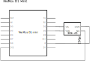
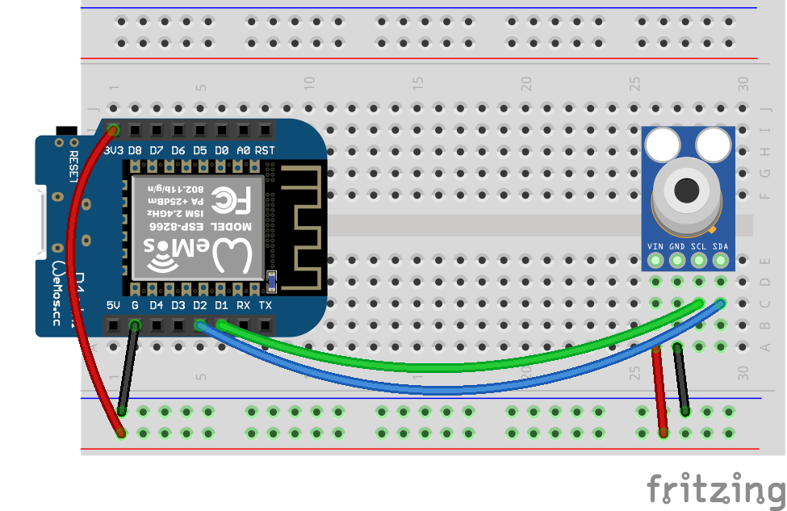

# ESP8266 and MLX90614 Infra-Red Temperature Sensor

Code for getting started with MLX90614 infra-red temperature sensor and an ESP8266 development board.

<br />

## Files and Folders

| File/Folder | Description |
|--- | --- |
| [arduino/](../arduino-uno/arduino) | For Arduino, use the sketches in the Arduino Uno folder [../arduino-uno/arduino](../arduino-uno/arduino) |
| [micropython/](micropython/) | folder for micropython scripts. Pymakr is configured to sync this folder with the micropython device. |
| [micropython/read_temperature.py](micropython/read_temperature.py) | micropython script that reads the temperature values and prints them to the repl. |
| [esp32-setup.md](esp32-setup.md) | Setup instructions for using an ESP32 dev board. |
| [esp8266-micropython-setup.ps1](esp8266-micropython-setup.ps1) | PowerShell script to install MicroPython on ESP8266 device and upload scripts. |
|  |  |

<br />

## Setup

Setup instructions for a WeMos D1 mini are below. For ESP32 based setup instructions see [esp32-setup.md](esp32-setup.md).

## Circuit Diagram

Wire the components as shown in the diagram.



#### Components Needed

* mlx90614 sensor breakout board
* connecting wires
* esp8266 device

<br />



<br />

### Default Pin Wiring

| Pin No | Function |  | Device Connection |
| --- | --- | --- | --- |
| 1 | +3.3V |  | Vin |
| 6 | GND |  | GND |
| D2 | GPIO4 |  | SDA |
| D1 | GPIO5 |  | SCL |
|  |  |  |  |


Further details and other board pin out diagrams can be found here: https://randomnerdtutorials.com/esp8266-pinout-reference-gpios/

<br />

## Arduino

The sketch will work with many different types and chipset of board. To use an ESP8266 board with Arduino IDE, you will need to install the relevant board configuration files. Follow the instructions here: https://arduino-esp8266.readthedocs.io/en/latest/installing.html

The arduino sketches require the Adafruit MLX90614 library. It is included in the root additional-libraries folder. Afternatively, they can be downloaded through the Arduino libraries manager or from https://github.com/adafruit/Adafruit-MLX90614-Library

<br />

## MicroPython

The MicroPython script uses a module from https://github.com/mcauser/micropython-mlx90614. It is included in the [micropython/lib](micropython/lib) folder.

### Uploading Files

Test files can be uploaded using [ampy](https://learn.adafruit.com/micropython-basics-load-files-and-run-code/install-ampy).

```pwsh
PS> ampy --port <COM port of device> --baud 115200 put micropython/read_temperature.py
PS> ampy --port <COM port of device> --baud 115200 put micropython/lib
```

A PowerShell script ([esp8266-micropython-setup.ps1](esp8266-micropython-setup.ps1)) is also included to automatically setup MicroPython on an ESP8266 device.

```pwsh
PS> .\esp8266-micropython-setup.ps1
```

<br />

## References

- https://randomnerdtutorials.com/esp8266-pinout-reference-gpios/
- https://github.com/mcauser/micropython-mlx90614
- https://github.com/adafruit/Adafruit-MLX90614-Library
